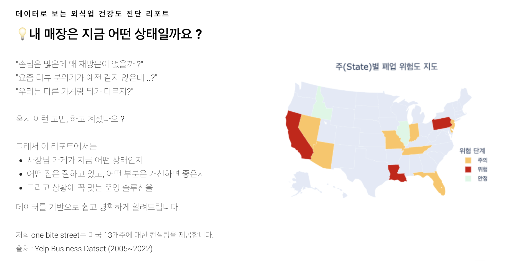
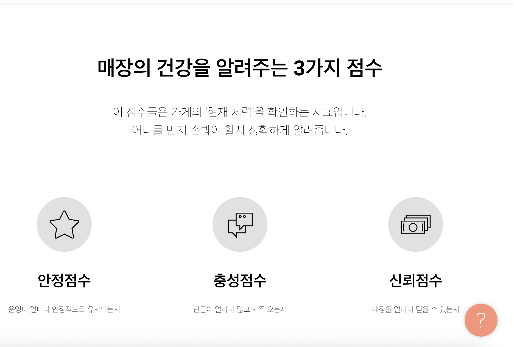
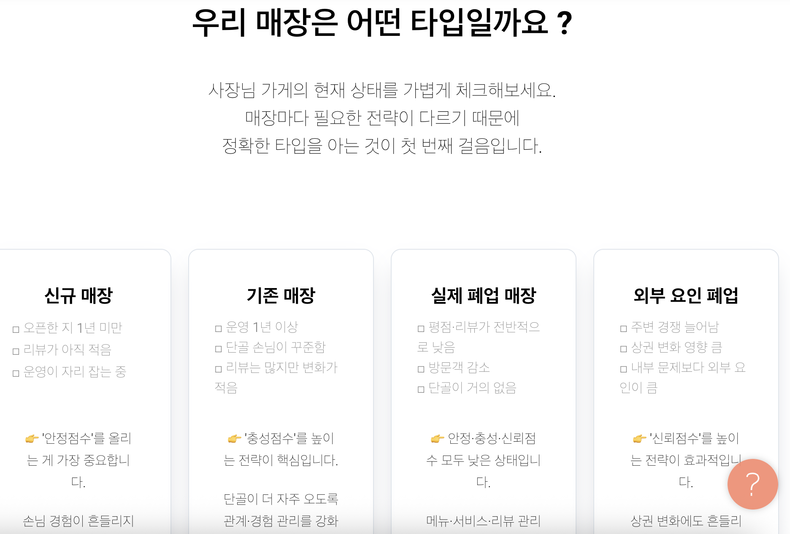
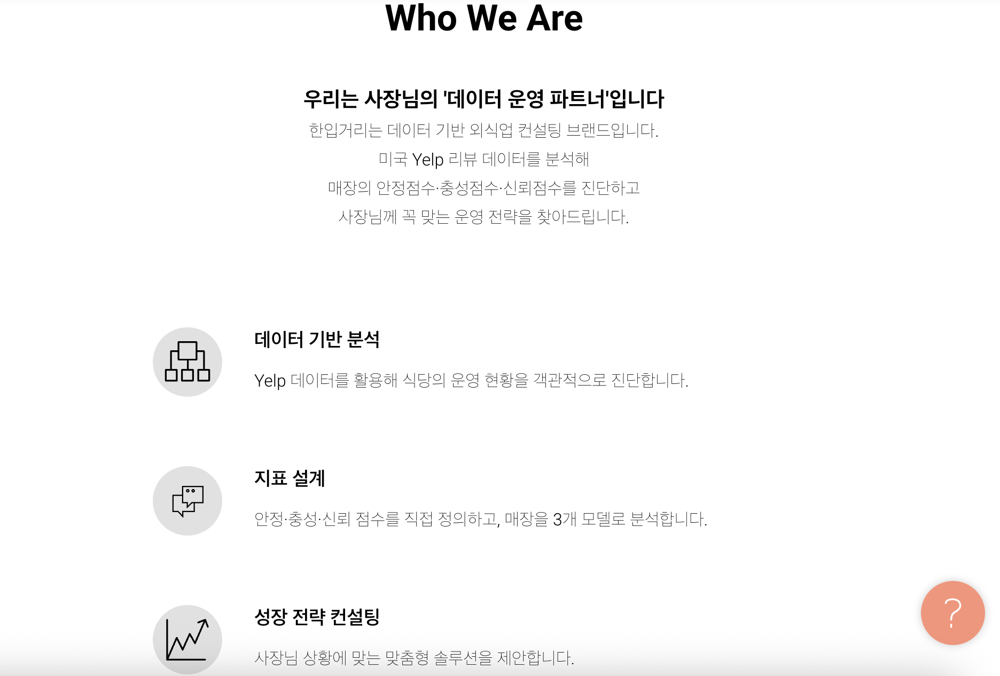

# Datathon-project

# 📊데이터톤 프로젝트 | 외식업 데이터 분석 (대상 수상)

데이터 분석 부트캠프 내 데이터톤 프로젝트로,  
외식업 데이터를 활용한 비즈니스 컨설팅 관점의 분석을 수행하여 **대상**을 수상한 프로젝트입니다.

## 📌 프로젝트 개요

| 항목 | 내용 |
|---|---|
| 프로젝트 유형 | 팀 프로젝트 (데이터톤) |
| 주제 | 가상의 외식업체 전문 비즈니스 컨설팅 회사 가정 |
| 데이터 출처 | Yelp Open Dataset |
| 기간 | 2025.10.20 ~ 2025.11.18 |
| 팀원 수 | 4명 |
| 개인 기여도 | 약 20% |
| 성과 | 🏆 데이터톤 대상 수상 |

---

## 👤 My Role & Contributions
**팀 프로젝트 내에서 제가 주도적으로 수행한 핵심 업무입니다.**

### 1️⃣ 신뢰지수(Reliability Score) 알고리즘 설계 및 분석
* **핵심 로직:** 브랜드 신뢰도를 정량화하기 위해 전문가 리뷰 비율, 엘리트 리뷰 비율, 리뷰어의 활동도를 결합한 고유 지표 설계
* **데이터 전처리:** 800만 건의 Yelp 리뷰 데이터 중 유효 리뷰를 선별하고, 가중치 산정을 위한 피처 엔지니어링 수행
* **인사이트:** 리뷰의 '양'보다 '질'이 신뢰도에 미치는 영향이 크다는 것을 통계적으로 입증하여 컨설팅 방향 제시

### 2️⃣ 비즈니스 전략 리포트 기획 및 제작 (Tilda 활용)
### 📂 비즈니스 전략 리포트 주요 화면 (Tilda)
**데이터 분석 결과를 실제 비즈니스 컨설팅 전략으로 연결한 리포트의 핵심 흐름입니다.**

| 1. 컨설팅 리포트 메인 | 2. 데이터 기반 분석 지표 | 3. 매장 타입별 맞춤 전략 |
| :---: | :---: | :---: |
|  |  |  |
| **Yelp 데이터를 활용한 건강도 진단** | **안정·충성·신뢰 3대 지표 설계** | **4가지 매장 타입 정의 및 처방** |

🔍 리포트 상세 분석 내용 더보기 (4~7번)

#### 📍 리포트 상세 구성
4. **[Who We Are]** 데이터 운영 파트너로서의 분석 방향성 제시 (`report4.png`)
5. **[지역 심층 분석]** AI가 분석한 Florida 외식 시장의 핵심 성공 요인 (`report6.png`)
6. **[메뉴 전략]** 데이터 기반의 메뉴 구성 및 효율화 솔루션 (`report7.png`)
7. **[컨설팅 제언]** 지역 트렌드를 반영한 최종 맞춤형 전략 제안 (`report8.png`)

    
  
  

*(현재 유로 호스팅 만료로 인해 캡처본으로 결과물을 대체합니다)*

### 📂 주요 프로젝트 결과물
* 📢 [프로젝트 최종 발표 자료 (Googole Drive)](https://drive.google.com/file/d/1G-HyjlQNYO-RMCPpx4Bjs0eGXtB3SIrg/view?usp=sharing)

### 💻 핵심 분석 및 모델링 코드
분석의 흐름 (설계->검증->인사이트 도출)에 따른 상세 작업 내역입니다.

* [📊 1. 신뢰지수(Reliability Score) 알고리즘 설계](./reliability_score.ipynb)
  - 리뷰 데이터와 유저 활동성을 결합한 고유 신뢰 지표 산출 로직 구현
* [🧪 2. 지표 시각화 및 통계적 타당성 검증](./reliaibility_validation.ipynb)
  - 매장 상태별 지표 분포 시각화 및 설계한 지표의 유효성 통계 검증
* [🤖 3. 신뢰 요인 분석 머신러닝 모델링 (CatBoost)](./reliability_model.ipynb)
  - 신뢰점수를 타겟으로 한 회귀 분석을 통해 **별점 일관성, 카테고리 적합성** 등 핵심 성공 요인 도출

### 💡 주요 분석 인사이트 (Key Insights)
* **운영 일관성:** 별점의 표준편차가 낮을수록(평가가 일정할수록) 소비자 신뢰도가 상승함
* **입지 및 카테고리:** 현지 친숙 카테고리(American Trad 등)가 유리하며, 밀집도가 낮은 포화되지 않은 입지에서 신뢰 형성 속도가 빠름
* **고객 충성도:** 충성 고객이 남기는 상세 리뷰가 매장 평판 강화의 핵심 동력임을 확인

---

## 🎯 문제 정의 및 목표

본 프로젝트는 가상의 외식업체 전문 비즈니스 컨설팅 회사를 가정하여,  
외식업 데이터를 기반으로 **의사결정에 활용 가능한 지표와 인사이트를 도출**하는 것을 목표로 진행되었습니다.

팀원 각자가 독립적인 지표를 정의하고,  
이를 통합하여 **선택적으로 활용 가능한 분석 API 설계**를 최종 목표로 설정하였습니다.

---

## 👤 담당 역할 및 기여

팀 내에서 아래 역할을 중심으로 프로젝트에 참여했습니다.

- 데이터 수집 및 전처리
- EDA 설계 및 분석 방향 설정
- 핵심 지표 정의 및 가설 설정
- 분석 결과 시각화 제작
- 인사이트 정리 및 발표 자료(PPT) 구성

※ 팀 프로젝트 특성상 전체 분석을 단독으로 수행하지는 않았으며,  
본인은 **지표 정의와 인사이트 도출 영역에 집중**하여 기여하였습니다.

---

## 🛠 사용 기술

- Python
- Pandas / NumPy
- Matplotlib / Seaborn
- Jupyter Notebook

---

## 🔍 문제 정의

외식업 분석에서 단순 매출 지표를 넘어,  
**컨설팅 관점에서 실제 의사결정에 활용 가능한 복합 지표를 정의**하고  
이를 통해 외식업체 운영 및 전략 수립에 도움이 되는 인사이트를 도출하고자 했습니다.

---

## 🧭 분석 접근 방식

본 프로젝트는 다음과 같은 단계로 분석을 진행했습니다.

1. **Yelp Open Dataset 구조 및 데이터 품질 파악**
2. 주제에 부합하는 **핵심 지표 정의**
3. 지표 기반 **가설 설정**
4. 시각화를 통한 **가설 검증**
5. 컨설팅 관점에서의 **비즈니스 인사이트 도출**
6. 지표를 통합한 **최종 API 설계 방향 제시**

---

## 📊 주요 분석 결과 및 인사이트

- 주제에 적합한 지표를 중심으로 가설을 설정하여  
  단순 현황 분석이 아닌 **원인 중심의 분석이 가능**했습니다.
- 지표 간 관계를 종합적으로 해석함으로써  
  **외식업 컨설팅에 즉시 활용 가능한 시사점**을 도출했습니다.
- 분석 결과를 API 형태로 확장 가능한 구조로 설계하여
  **실무 적용 가능성 측면에서 높은 평가**를 받았습니다.

---

## 🏆 대상 수상 배경 (개인 관점)

- 문제 정의 → 지표 설계 → 가설 → 인사이트로 이어지는  
  **분석 흐름이 처음부터 끝까지 일관되게 구성**된 점
- 주제에 적합한 가설 설정과 **명확한 인사이트 도출**
- 분석 결과를 단순 통계 해석이 아닌  
  **비즈니스 컨설팅 관점에서 해석**했다는 점에서  
  높은 평가를 받았다고 판단합니다.

---

## ⚠️ 한계 및 개선 방향
- 본 데이터톤은 **제한된 기간과 공개 데이터(Yelp Open Dataset)** 를 기반으로 진행되어,
  실제 매출·원가·고객 재방문 데이터 등 내부 운영 지표를 충분히 반영하지 못한 한계가 있습니다.
- 향후 실제 서비스 데이터 또는 실시간 데이터와 연동할 경우,
  지표 간 인과 관계를 보다 정교하게 검증하고 예측 모델 및 지표 고도화로 확장 가능하다고 판단합니다.
